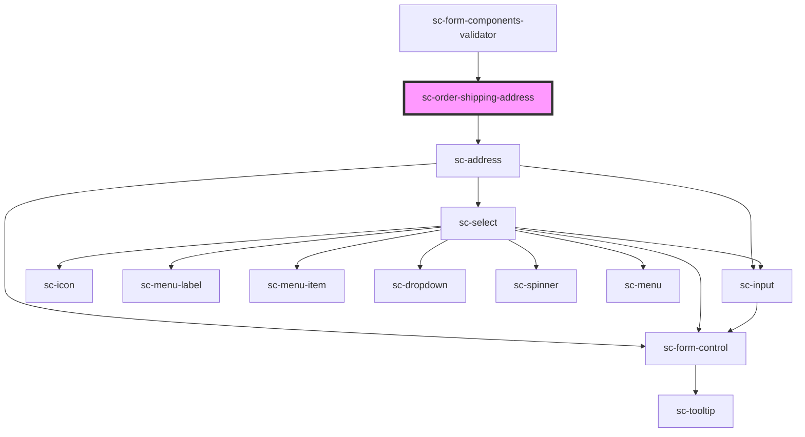

# ce-order-shipping-address

<!-- Auto Generated Below -->

## Properties

| Property                  | Attribute    | Description                           | Type                                                                                                                                          | Default     |
| ------------------------- | ------------ | ------------------------------------- | --------------------------------------------------------------------------------------------------------------------------------------------- | ----------- |
| `customerShippingAddress` | --           | Holds the customer's shipping address | `Address`                                                                                                                                     | `undefined` |
| `label`                   | `label`      | Label for the field.                  | `string`                                                                                                                                      | `undefined` |
| `loading`                 | `loading`    | Is this loading.                      | `boolean`                                                                                                                                     | `undefined` |
| `required`                | `required`   | Is this required (defaults to true)   | `boolean`                                                                                                                                     | `true`      |
| `shippingAddress`         | --           | Holds the customer's billing address  | `Address`                                                                                                                                     | `undefined` |
| `taxStatus`               | `tax-status` | Tax status of the order               | `"address_invalid" \| "calculated" \| "disabled" \| "estimated" \| "reverse_charged" \| "tax_registration_not_found" \| "tax_zone_not_found"` | `undefined` |

## Events

| Event           | Description                         | Type                                                                                                                                                                                                                                                                                                                                                                                                                                                                                                                                                                                                                                                                                                                                                                                                                                                                                                                                                                                                                                                                                                                            |
| --------------- | ----------------------------------- | ------------------------------------------------------------------------------------------------------------------------------------------------------------------------------------------------------------------------------------------------------------------------------------------------------------------------------------------------------------------------------------------------------------------------------------------------------------------------------------------------------------------------------------------------------------------------------------------------------------------------------------------------------------------------------------------------------------------------------------------------------------------------------------------------------------------------------------------------------------------------------------------------------------------------------------------------------------------------------------------------------------------------------------------------------------------------------------------------------------------------------- |
| `scUpdateOrder` | Make a request to update the order. | `CustomEvent<{ id?: string; status?: "finalized" \| "draft" \| "paid"; number?: string; amount_due?: number; trial_amount?: number; charge?: string \| Charge; name?: string; email?: string; live_mode?: boolean; currency?: string; total_amount?: number; subtotal_amount?: number; tax_amount?: number; tax_status?: "disabled" \| "address_invalid" \| "estimated" \| "calculated"; tax_label?: string; line_items?: lineItems; metadata?: Object; payment_intent?: PaymentIntent; customer?: string \| Customer; subscriptions?: { object: "list"; pagination: Pagination; data: Subscription[]; }; discount_amount?: number; discount?: DiscountResponse; billing_address?: string \| Address; shipping_address?: string \| Address; processor_data?: ProcessorData; tax_identifier?: { number: string; number_type: string; }; url?: string; created_at?: number; constructor?: Function; toString?: () => string; toLocaleString?: () => string; valueOf?: () => Object; hasOwnProperty?: (v: PropertyKey) => boolean; isPrototypeOf?: (v: Object) => boolean; propertyIsEnumerable?: (v: PropertyKey) => boolean; }>` |

## Dependencies

### Used by

 - [sc-form-components-validator](../../../providers/form-components-validator)

### Depends on

- [sc-address](../../../ui/address)

### Graph

----------------------------------------------

*Built with [StencilJS](https://stenciljs.com/)*
