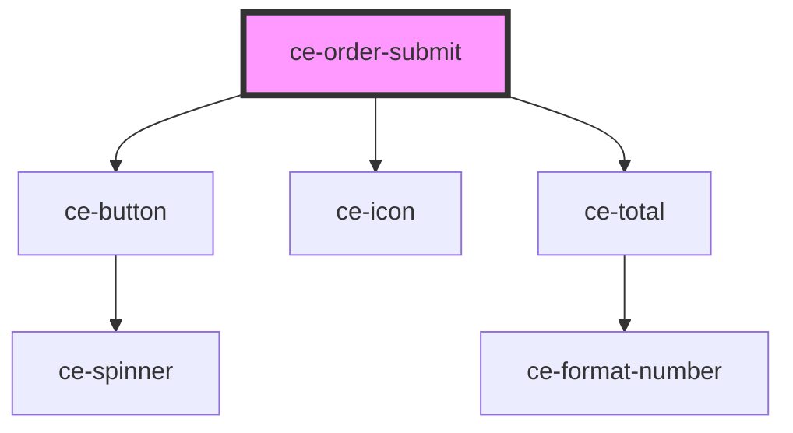

# ce-order-submit

<!-- Auto Generated Below -->

## Properties

| Property    | Attribute    | Description               | Type                                                                                         | Default     |
| ----------- | ------------ | ------------------------- | -------------------------------------------------------------------------------------------- | ----------- |
| `busy`      | `busy`       | Is the order busy         | `boolean`                                                                                    | `undefined` |
| `full`      | `full`       | Show a full-width button. | `boolean`                                                                                    | `true`      |
| `icon`      | `icon`       | Icon to show.             | `string`                                                                                     | `undefined` |
| `loading`   | `loading`    | Is the order loading.     | `boolean`                                                                                    | `undefined` |
| `paying`    | `paying`     | Is the order paying.      | `boolean`                                                                                    | `undefined` |
| `showTotal` | `show-total` | Show the total.           | `boolean`                                                                                    | `undefined` |
| `size`      | `size`       | The button's size.        | `"large" \| "medium" \| "small"`                                                             | `'medium'`  |
| `type`      | `type`       | The button type.          | `"danger" \| "default" \| "info" \| "link" \| "primary" \| "success" \| "text" \| "warning"` | `'primary'` |

## Dependencies

### Depends on

- [ce-button](../../../ui/button)
- [ce-icon](../../../ui/icon)
- [ce-total](../total)

### Graph

----------------------------------------------

*Built with [StencilJS](https://stenciljs.com/)*
