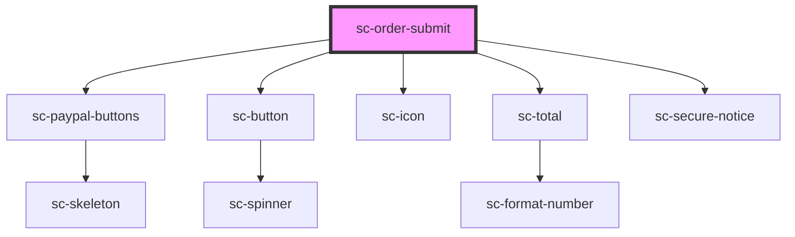

# ce-order-submit

<!-- Auto Generated Below -->

## Properties

| Property           | Attribute            | Description                      | Type                                                                                         | Default     |
| ------------------ | -------------------- | -------------------------------- | -------------------------------------------------------------------------------------------- | ----------- |
| `busy`             | `busy`               | Is the order busy                | `boolean`                                                                                    | `undefined` |
| `currencyCode`     | `currency-code`      | Currency Code                    | `string`                                                                                     | `'usd'`     |
| `full`             | `full`               | Show a full-width button.        | `boolean`                                                                                    | `true`      |
| `icon`             | `icon`               | Icon to show.                    | `string`                                                                                     | `undefined` |
| `loading`          | `loading`            | Is the order loading.            | `boolean`                                                                                    | `undefined` |
| `mode`             | `mode`               | Is this created in "test" mode   | `"live" \| "test"`                                                                           | `'live'`    |
| `order`            | --                   | The current order.               | `Checkout`                                                                                   | `undefined` |
| `paying`           | `paying`             | Is the order paying.             | `boolean`                                                                                    | `undefined` |
| `processor`        | `processor`          | The selected processor.          | `"paypal" \| "paypal-card" \| "stripe"`                                                      | `undefined` |
| `processors`       | --                   | Keys and secrets for processors. | `Processor[]`                                                                                | `undefined` |
| `secureNotice`     | `secure-notice`      | Show the secure notice           | `boolean`                                                                                    | `true`      |
| `secureNoticeText` | `secure-notice-text` | Secure                           | `string`                                                                                     | `undefined` |
| `showTotal`        | `show-total`         | Show the total.                  | `boolean`                                                                                    | `undefined` |
| `size`             | `size`               | The button's size.               | `"large" \| "medium" \| "small"`                                                             | `'medium'`  |
| `type`             | `type`               | The button type.                 | `"danger" \| "default" \| "info" \| "link" \| "primary" \| "success" \| "text" \| "warning"` | `'primary'` |

## Dependencies

### Depends on

- [sc-paypal-buttons](../../../ui/paypal-buttons)
- [sc-button](../../../ui/button)
- [sc-icon](../../../ui/icon)
- [sc-total](../total)
- [sc-secure-notice](../../../ui/secure-notice)

### Graph

----------------------------------------------

*Built with [StencilJS](https://stenciljs.com/)*
