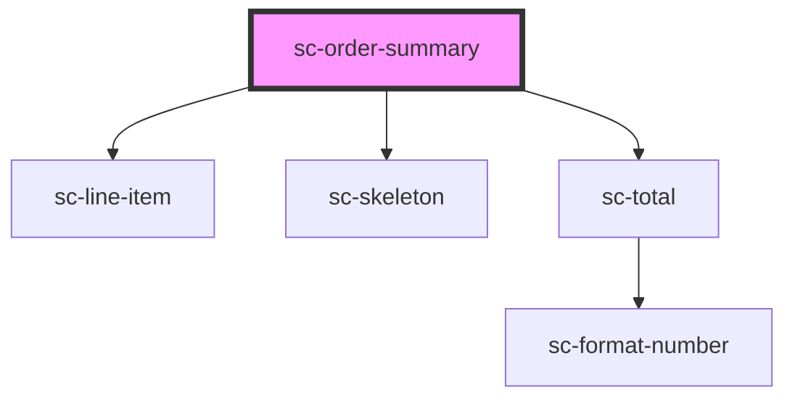

# ce-order-summary

<!-- Auto Generated Below -->

## Properties

| Property      | Attribute     | Description | Type      | Default                          |
| ------------- | ------------- | ----------- | --------- | -------------------------------- |
| `closedText`  | `closed-text` |             | `string`  | `__('Show Summary', 'surecart')` |
| `collapsed`   | `collapsed`   |             | `boolean` | `undefined`                      |
| `collapsible` | `collapsible` |             | `boolean` | `false`                          |
| `empty`       | `empty`       |             | `boolean` | `undefined`                      |
| `loading`     | `loading`     |             | `boolean` | `undefined`                      |
| `openText`    | `open-text`   |             | `string`  | `__('Summary', 'surecart')`      |
| `order`       | --            |             | `Order`   | `undefined`                      |

## Dependencies

### Depends on

- [sc-line-item](../../../ui/line-item)
- [sc-skeleton](../../../ui/skeleton)
- [sc-total](../total)

### Graph

----------------------------------------------

*Built with [StencilJS](https://stenciljs.com/)*
