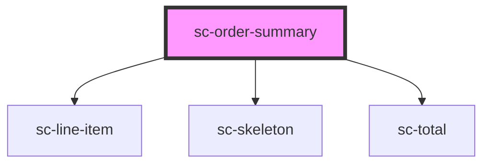

# ce-order-summary

<!-- Auto Generated Below -->

## Properties

| Property             | Attribute              | Description | Type       | Default                             |
| -------------------- | ---------------------- | ----------- | ---------- | ----------------------------------- |
| `busy`               | `busy`                 |             | `boolean`  | `undefined`                         |
| `collapsed`          | `collapsed`            |             | `boolean`  | `false`                             |
| `collapsedOnDesktop` | `collapsed-on-desktop` |             | `boolean`  | `undefined`                         |
| `collapsedOnMobile`  | `collapsed-on-mobile`  |             | `boolean`  | `false`                             |
| `collapsible`        | `collapsible`          |             | `boolean`  | `false`                             |
| `invoiceSummaryText` | `invoice-summary-text` |             | `string`   | `__('Invoice Summary', 'surecart')` |
| `order`              | --                     |             | `Checkout` | `undefined`                         |
| `orderSummaryText`   | `order-summary-text`   |             | `string`   | `__('Summary', 'surecart')`         |

## Events

| Event    | Description     | Type                |
| -------- | --------------- | ------------------- |
| `scHide` | Show the toggle | `CustomEvent<void>` |
| `scShow` | Show the toggle | `CustomEvent<void>` |

## Dependencies

### Depends on

- [sc-line-item](../../../ui/line-item)
- [sc-skeleton](../../../ui/skeleton)
- [sc-total](../total)

### Graph

----------------------------------------------

*Built with [StencilJS](https://stenciljs.com/)*
