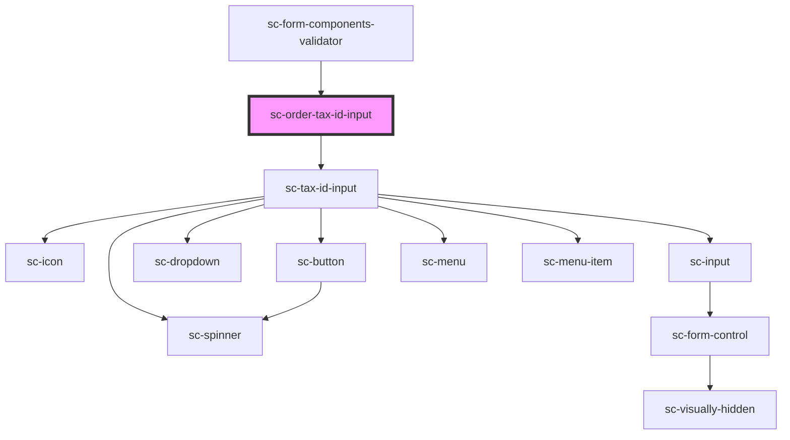

# ce-tax-id-input

<!-- Auto Generated Below -->

## Properties

| Property     | Attribute      | Description                                                 | Type                 | Default     |
| ------------ | -------------- | ----------------------------------------------------------- | -------------------- | ----------- |
| `auAbnLabel` | `au-abn-label` | AU zone label                                               | `string`             | `undefined` |
| `caGstLabel` | `ca-gst-label` | GST zone label                                              | `string`             | `undefined` |
| `euVatLabel` | `eu-vat-label` | EU zone label                                               | `string`             | `undefined` |
| `gbVatLabel` | `gb-vat-label` | UK zone label                                               | `string`             | `undefined` |
| `helpText`   | `help-text`    | Help text                                                   | `string`             | `undefined` |
| `otherLabel` | `other-label`  | Other zones label                                           | `string`             | `undefined` |
| `show`       | `show`         | Force show the field.                                       | `boolean`            | `false`     |
| `taxIdTypes` | `tax-id-types` | Tax ID Types which will be shown Eg: '["eu_vat", "gb_vat"]' | `string \| string[]` | `undefined` |

## Methods

### `reportValidity() => Promise<boolean>`

#### Returns

Type: `Promise<boolean>`

## Dependencies

### Used by

 - [sc-form-components-validator](../../../providers/form-components-validator)

### Depends on

- [sc-tax-id-input](../../../ui/tax-id-input)

### Graph

----------------------------------------------

*Built with [StencilJS](https://stenciljs.com/)*
