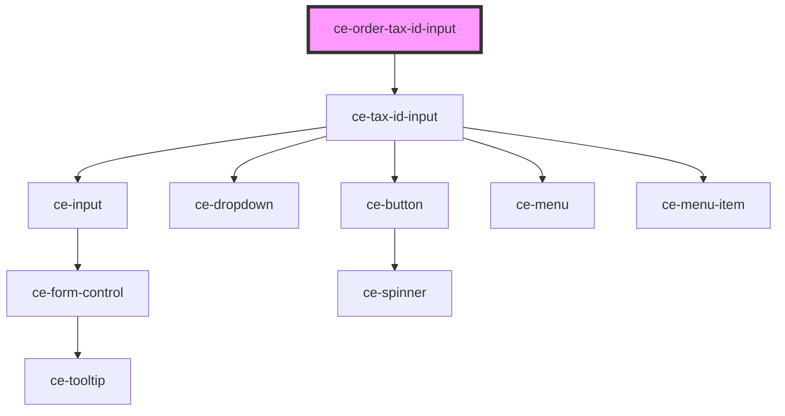

# ce-tax-id-input

<!-- Auto Generated Below -->

## Properties

| Property | Attribute | Description           | Type                                                                                                                                                                                                                                                                                                                                                                                                                                                                                                                                                                                                                                                                                                                                                                                                                                                                                                                                                                                                                                                                                                               | Default     |
| -------- | --------- | --------------------- | ------------------------------------------------------------------------------------------------------------------------------------------------------------------------------------------------------------------------------------------------------------------------------------------------------------------------------------------------------------------------------------------------------------------------------------------------------------------------------------------------------------------------------------------------------------------------------------------------------------------------------------------------------------------------------------------------------------------------------------------------------------------------------------------------------------------------------------------------------------------------------------------------------------------------------------------------------------------------------------------------------------------------------------------------------------------------------------------------------------------ | ----------- |
| `order`  | --        | The order             | `{ id?: string; status?: "finalized" \| "draft" \| "paid"; number?: string; amount_due?: number; trial_amount?: number; charge?: string \| Charge; name?: string; email?: string; live_mode?: boolean; currency?: string; total_amount?: number; subtotal_amount?: number; tax_amount?: number; tax_status?: "disabled" \| "address_invalid" \| "estimated" \| "calculated"; tax_label?: string; line_items?: lineItems; metadata?: Object; payment_intent?: PaymentIntent; customer?: string \| Customer; subscriptions?: { object: "list"; pagination: Pagination; data: Subscription[]; }; discount_amount?: number; discount?: DiscountResponse; billing_address?: string \| Address; shipping_address?: string \| Address; processor_data?: ProcessorData; tax_identifier?: { number: string; number_type: string; }; url?: string; created_at?: number; constructor?: Function; toString?: () => string; toLocaleString?: () => string; valueOf?: () => Object; hasOwnProperty?: (v: PropertyKey) => boolean; isPrototypeOf?: (v: Object) => boolean; propertyIsEnumerable?: (v: PropertyKey) => boolean; }` | `undefined` |
| `show`   | `show`    | Force show the field. | `boolean`                                                                                                                                                                                                                                                                                                                                                                                                                                                                                                                                                                                                                                                                                                                                                                                                                                                                                                                                                                                                                                                                                                          | `false`     |

## Events

| Event           | Description                         | Type                                                                                                                                                                                                                                                                                                                                                                                                                                                                                                                                                                                                                                                                                                                                                                                                                                                                                                                                                                                                                                                                                                                            |
| --------------- | ----------------------------------- | ------------------------------------------------------------------------------------------------------------------------------------------------------------------------------------------------------------------------------------------------------------------------------------------------------------------------------------------------------------------------------------------------------------------------------------------------------------------------------------------------------------------------------------------------------------------------------------------------------------------------------------------------------------------------------------------------------------------------------------------------------------------------------------------------------------------------------------------------------------------------------------------------------------------------------------------------------------------------------------------------------------------------------------------------------------------------------------------------------------------------------- |
| `ceUpdateOrder` | Make a request to update the order. | `CustomEvent<{ id?: string; status?: "finalized" \| "draft" \| "paid"; number?: string; amount_due?: number; trial_amount?: number; charge?: string \| Charge; name?: string; email?: string; live_mode?: boolean; currency?: string; total_amount?: number; subtotal_amount?: number; tax_amount?: number; tax_status?: "disabled" \| "address_invalid" \| "estimated" \| "calculated"; tax_label?: string; line_items?: lineItems; metadata?: Object; payment_intent?: PaymentIntent; customer?: string \| Customer; subscriptions?: { object: "list"; pagination: Pagination; data: Subscription[]; }; discount_amount?: number; discount?: DiscountResponse; billing_address?: string \| Address; shipping_address?: string \| Address; processor_data?: ProcessorData; tax_identifier?: { number: string; number_type: string; }; url?: string; created_at?: number; constructor?: Function; toString?: () => string; toLocaleString?: () => string; valueOf?: () => Object; hasOwnProperty?: (v: PropertyKey) => boolean; isPrototypeOf?: (v: Object) => boolean; propertyIsEnumerable?: (v: PropertyKey) => boolean; }>` |

## Dependencies

### Depends on

- [ce-tax-id-input](../../../ui/tax-id-input)

### Graph

----------------------------------------------

*Built with [StencilJS](https://stenciljs.com/)*
