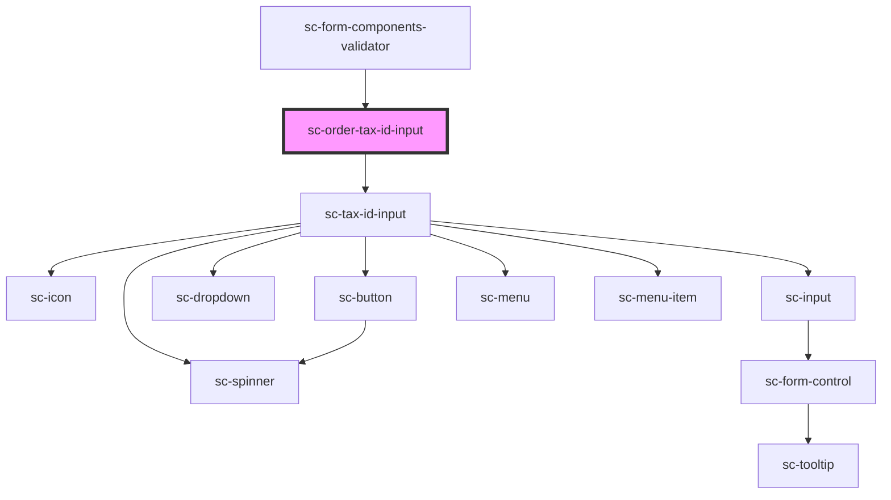

# ce-tax-id-input

<!-- Auto Generated Below -->

## Properties

| Property        | Attribute | Description           | Type                                                                                                                                                                                                                                                                                                                                                                                                                                                                                                                                                                                                                                                                                                                                                                                                                                                                                                                                                                                                                                                                                                                                                                                                                                                                                                                                                                                                                                                                                                                                                                                                                                                                                                                                                                                                                                                                                        | Default     |
| --------------- | --------- | --------------------- | ------------------------------------------------------------------------------------------------------------------------------------------------------------------------------------------------------------------------------------------------------------------------------------------------------------------------------------------------------------------------------------------------------------------------------------------------------------------------------------------------------------------------------------------------------------------------------------------------------------------------------------------------------------------------------------------------------------------------------------------------------------------------------------------------------------------------------------------------------------------------------------------------------------------------------------------------------------------------------------------------------------------------------------------------------------------------------------------------------------------------------------------------------------------------------------------------------------------------------------------------------------------------------------------------------------------------------------------------------------------------------------------------------------------------------------------------------------------------------------------------------------------------------------------------------------------------------------------------------------------------------------------------------------------------------------------------------------------------------------------------------------------------------------------------------------------------------------------------------------------------------------------- | ----------- |
| `busy`          | `busy`    | Is this busy          | `boolean`                                                                                                                                                                                                                                                                                                                                                                                                                                                                                                                                                                                                                                                                                                                                                                                                                                                                                                                                                                                                                                                                                                                                                                                                                                                                                                                                                                                                                                                                                                                                                                                                                                                                                                                                                                                                                                                                                   | `false`     |
| `order`         | --        | The order             | `{ id?: string; status?: "finalized" \| "draft" \| "paid" \| "requires_approval"; staged_payment_intents?: { object: "list"; pagination: Pagination; data: PaymentIntent[]; }; bump_amount?: number; payment_method_required?: boolean; manual_payment?: boolean; manual_payment_method?: string \| ManualPaymentMethod; reusable_payment_method_required?: boolean; number?: string; amount_due?: number; trial_amount?: number; charge?: string \| Charge; name?: string; email?: string; live_mode?: boolean; currency?: string; total_amount?: number; subtotal_amount?: number; full_amount?: number; proration_amount?: number; scratch_amount?: number; applied_balance_amount?: number; discounts?: number; tax_amount?: number; tax_inclusive_amount?: number; tax_exclusive_amount?: number; tax_status?: "disabled" \| "address_invalid" \| "estimated" \| "calculated"; tax_label?: string; tax_percent?: number; line_items?: lineItems; recommended_bumps?: { object: "list"; pagination: Pagination; data: Bump[]; }; metadata?: any; payment_intent?: PaymentIntent; payment_method?: PaymentMethod; order?: string \| Order; customer?: string \| Customer; subscriptions?: { object: "list"; pagination: Pagination; data: Subscription[]; }; purchases?: { object: "list"; pagination: Pagination; data: Purchase[]; }; discount_amount?: number; discount?: DiscountResponse; billing_address?: string \| Address; shipping_address?: string \| Address; shipping_enabled?: boolean; processor_data?: ProcessorData; tax_identifier?: { number: string; number_type: string; }; url?: string; created_at?: number; constructor?: Function; toString?: () => string; toLocaleString?: () => string; valueOf?: () => Object; hasOwnProperty?: (v: PropertyKey) => boolean; isPrototypeOf?: (v: Object) => boolean; propertyIsEnumerable?: (v: PropertyKey) => boolean; }` | `undefined` |
| `show`          | `show`    | Force show the field. | `boolean`                                                                                                                                                                                                                                                                                                                                                                                                                                                                                                                                                                                                                                                                                                                                                                                                                                                                                                                                                                                                                                                                                                                                                                                                                                                                                                                                                                                                                                                                                                                                                                                                                                                                                                                                                                                                                                                                                   | `false`     |
| `taxIdentifier` | --        | Tax identifier        | `TaxIdentifier`                                                                                                                                                                                                                                                                                                                                                                                                                                                                                                                                                                                                                                                                                                                                                                                                                                                                                                                                                                                                                                                                                                                                                                                                                                                                                                                                                                                                                                                                                                                                                                                                                                                                                                                                                                                                                                                                             | `undefined` |
| `taxProtocol`   | --        | The tax protocol.     | `TaxProtocol`                                                                                                                                                                                                                                                                                                                                                                                                                                                                                                                                                                                                                                                                                                                                                                                                                                                                                                                                                                                                                                                                                                                                                                                                                                                                                                                                                                                                                                                                                                                                                                                                                                                                                                                                                                                                                                                                               | `undefined` |

## Events

| Event           | Description                         | Type                                                                         |
| --------------- | ----------------------------------- | ---------------------------------------------------------------------------- |
| `scUpdateOrder` | Make a request to update the order. | `CustomEvent<{ data: Partial<Checkout>; options?: { silent?: boolean; }; }>` |

## Dependencies

### Used by

 - [sc-form-components-validator](../../../providers/form-components-validator)

### Depends on

- [sc-tax-id-input](../../../ui/tax-id-input)

### Graph

----------------------------------------------

*Built with [StencilJS](https://stenciljs.com/)*
