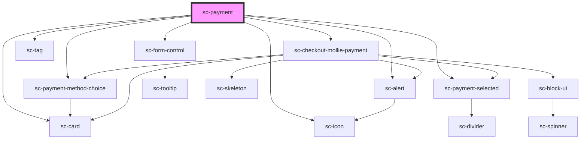

# ce-payment

<!-- Auto Generated Below -->

## Properties

| Property                 | Attribute                | Description              | Type       | Default     |
| ------------------------ | ------------------------ | ------------------------ | ---------- | ----------- |
| `disabledProcessorTypes` | --                       | Disabled processor types | `string[]` | `undefined` |
| `hideTestModeBadge`      | `hide-test-mode-badge`   | Hide the test mode badge | `boolean`  | `undefined` |
| `label`                  | `label`                  | The input's label.       | `string`   | `undefined` |
| `secureNotice`           | `secure-notice`          |                          | `string`   | `undefined` |
| `stripePaymentElement`   | `stripe-payment-element` |                          | `boolean`  | `undefined` |

## Shadow Parts

| Part                    | Description                                    |
| ----------------------- | ---------------------------------------------- |
| `"base"`                | The elements base wrapper.                     |
| `"form-control"`        | The form control wrapper.                      |
| `"help-text"`           | Help text that describes how to use the input. |
| `"label"`               | The input label.                               |
| `"test-badge__base"`    | Test badge base.                               |
| `"test-badge__content"` | Test badge content.                            |

## Dependencies

### Depends on

- [sc-payment-method-choice](../../../processors/sc-payment-method-choice)
- [sc-icon](../../../ui/icon)
- [sc-card](../../../ui/card)
- [sc-payment-selected](../../../ui/payment-selected)
- [sc-form-control](../../../ui/form-control)
- [sc-tag](../../../ui/tag)
- [sc-checkout-mollie-payment](../sc-checkout-mollie-payment)
- [sc-alert](../../../ui/alert)

### Graph

----------------------------------------------

*Built with [StencilJS](https://stenciljs.com/)*
