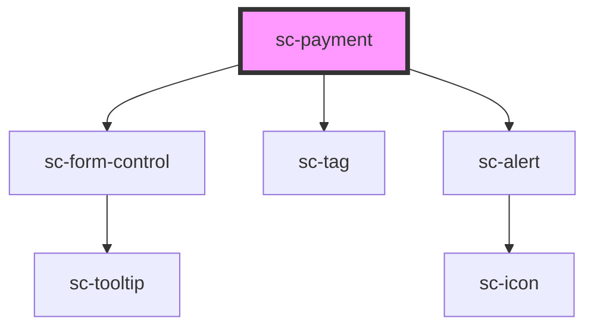

# ce-payment

<!-- Auto Generated Below -->

## Properties

| Property            | Attribute              | Description                        | Type               | Default     |
| ------------------- | ---------------------- | ---------------------------------- | ------------------ | ----------- |
| `checkout`          | --                     | Checkout Session from sc-checkout. | `Checkout`         | `undefined` |
| `hideTestModeBadge` | `hide-test-mode-badge` | Hide the test mode badge           | `boolean`          | `undefined` |
| `label`             | `label`                | The input's label.                 | `string`           | `undefined` |
| `mode`              | `mode`                 | Is this created in "test" mode     | `"live" \| "test"` | `'live'`    |
| `processor`         | `processor`            | The current selected processor.    | `string`           | `undefined` |
| `processors`        | --                     | List of available processors.      | `Processor[]`      | `[]`        |

## Events

| Event            | Description                | Type                                            |
| ---------------- | -------------------------- | ----------------------------------------------- |
| `scSetProcessor` | Set the checkout procesor. | `CustomEvent<{ id: string; manual: boolean; }>` |

## Shadow Parts

| Part                           | Description                                    |
| ------------------------------ | ---------------------------------------------- |
| `"base"`                       | The elements base wrapper.                     |
| `"form-control"`               | The form control wrapper.                      |
| `"help-text"`                  | Help text that describes how to use the input. |
| `"instructions"`               | Payment instructions.                          |
| `"instructions__divider"`      | Payment instructions divider.                  |
| `"instructions__divider-line"` | Payment instructions divider line.             |
| `"instructions__text"`         | Payment instructions text.                     |
| `"label"`                      | The input label.                               |
| `"loading"`                    |                                                |
| `"secure-notice__base"`        | Secure notice base.                            |
| `"secure-notice__icon"`        | Secure notice icon.                            |
| `"secure-notice__text"`        | Secure notice text.                            |
| `"test-badge__base"`           | Test badge base.                               |
| `"test-badge__content"`        | Test badge content.                            |
| `"toggle"`                     |                                                |
| `"toggle__base"`               | Toggle base.                                   |
| `"toggle__content"`            | Toggle content                                 |
| `"toggle__header"`             | Toggle header                                  |
| `"toggle__radio"`              | Toggle radio                                   |
| `"toggle__summary"`            | Toggle summary                                 |
| `"toggle__summary-icon"`       | Toggle icon                                    |
| `"toggles"`                    |                                                |

## Dependencies

### Depends on

- [sc-form-control](../../../ui/form-control)
- [sc-tag](../../../ui/tag)
- [sc-alert](../../../ui/alert)

### Graph

----------------------------------------------

*Built with [StencilJS](https://stenciljs.com/)*
