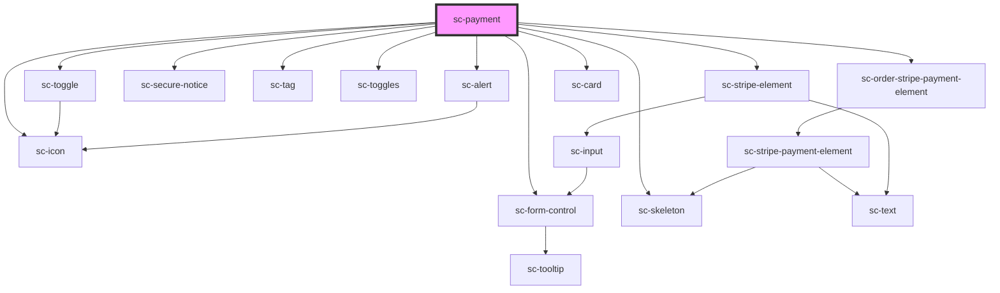

# ce-payment

<!-- Auto Generated Below -->

## Properties

| Property               | Attribute                | Description                                                          | Type                                    | Default     |
| ---------------------- | ------------------------ | -------------------------------------------------------------------- | --------------------------------------- | ----------- |
| `busy`                 | `busy`                   | Is this busy.                                                        | `boolean`                               | `undefined` |
| `currencyCode`         | `currency-code`          | The currency code.                                                   | `string`                                | `'usd'`     |
| `defaultProcessor`     | `default-processor`      | Default                                                              | `"paypal" \| "paypal-card" \| "stripe"` | `'stripe'`  |
| `hideTestModeBadge`    | `hide-test-mode-badge`   | Hide the test mode badge                                             | `boolean`                               | `undefined` |
| `label`                | `label`                  | The input's label.                                                   | `string`                                | `undefined` |
| `loading`              | `loading`                | Is this loading.                                                     | `boolean`                               | `undefined` |
| `mode`                 | `mode`                   | Is this created in "test" mode                                       | `"live" \| "test"`                      | `'live'`    |
| `order`                | --                       | Checkout Session from sc-checkout.                                   | `Order`                                 | `undefined` |
| `paymentMethod`        | `payment-method`         | Payment mode inside individual payment method (i.e. Payment Buttons) | `"stripe-payment-request"`              | `undefined` |
| `processor`            | `processor`              | The current payment method for the payment                           | `string`                                | `'stripe'`  |
| `processors`           | --                       | List of available processors.                                        | `Processor[]`                           | `[]`        |
| `secureNotice`         | `secure-notice`          | Secure notice                                                        | `string`                                | `undefined` |
| `stripePaymentElement` | `stripe-payment-element` | Use the Stripe payment element.                                      | `boolean`                               | `undefined` |

## Events

| Event            | Description             | Type                                                 |
| ---------------- | ----------------------- | ---------------------------------------------------- |
| `scSetProcessor` | Set the order procesor. | `CustomEvent<"paypal" \| "paypal-card" \| "stripe">` |

## Dependencies

### Depends on

- [sc-order-stripe-payment-element](../sc-order-stripe-payment-element)
- [sc-stripe-element](../../../ui/stripe-element)
- [sc-secure-notice](../../../ui/secure-notice)
- [sc-tag](../../../ui/tag)
- [sc-form-control](../../../ui/form-control)
- [sc-toggles](../../../ui/sc-toggles)
- [sc-toggle](../../../ui/sc-toggle)
- [sc-icon](../../../ui/icon)
- [sc-skeleton](../../../ui/skeleton)
- [sc-alert](../../../ui/alert)
- [sc-card](../../../ui/card)

### Graph

----------------------------------------------

*Built with [StencilJS](https://stenciljs.com/)*
