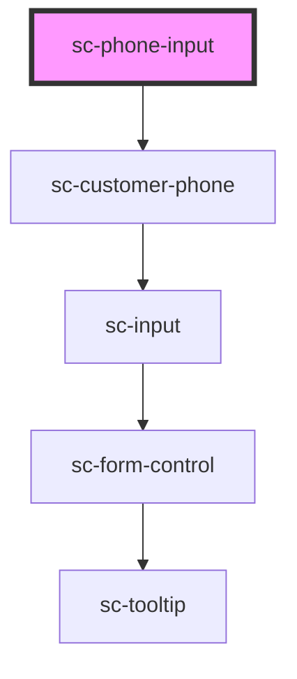

# ce-customer-name

<!-- Auto Generated Below -->

## Properties

| Property      | Attribute     | Description                       | Type                             | Default     |
| ------------- | ------------- | --------------------------------- | -------------------------------- | ----------- |
| `disabled`    | `disabled`    | Disables the input.               | `boolean`                        | `false`     |
| `help`        | `help`        | The input's help text.            | `string`                         | `''`        |
| `label`       | `label`       | The input's label.                | `string`                         | `undefined` |
| `loggedIn`    | `logged-in`   | Is the user logged in.            | `boolean`                        | `undefined` |
| `placeholder` | `placeholder` | The input's placeholder text.     | `string`                         | `undefined` |
| `readonly`    | `readonly`    | Makes the input readonly.         | `boolean`                        | `false`     |
| `required`    | `required`    | Makes the input a required field. | `boolean`                        | `false`     |
| `showLabel`   | `show-label`  | Should we show the label          | `boolean`                        | `true`      |
| `size`        | `size`        | The input's size.                 | `"large" \| "medium" \| "small"` | `'medium'`  |
| `value`       | `value`       | The input's value attribute.      | `string`                         | `''`        |

## Dependencies

### Depends on

- [sc-customer-phone](../customer-phone)

### Graph

----------------------------------------------

*Built with [StencilJS](https://stenciljs.com/)*
