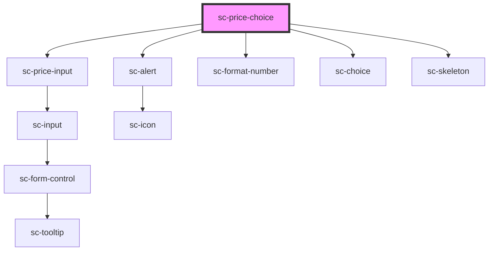

# ce-price-choice

<!-- Auto Generated Below -->

## Properties

| Property      | Attribute      | Description                     | Type                         | Default     |
| ------------- | -------------- | ------------------------------- | ---------------------------- | ----------- |
| `checked`     | `checked`      | Is this checked by default      | `boolean`                    | `false`     |
| `description` | `description`  | Label for the choice.           | `string`                     | `undefined` |
| `error`       | --             | Errors from response            | `ResponseError`              | `undefined` |
| `isAdHoc`     | --             | Is this an ad-hoc price choice  | `Boolean`                    | `undefined` |
| `label`       | `label`        | Label for the choice.           | `string`                     | `undefined` |
| `loading`     | `loading`      | Is this loading                 | `boolean`                    | `false`     |
| `order`       | --             | Session                         | `Order`                      | `undefined` |
| `price`       | --             | Stores the price                | `Price`                      | `undefined` |
| `priceId`     | `price-id`     | Id of the price.                | `string`                     | `undefined` |
| `prices`      | --             | Price entities                  | `{ [id: string]: Price; }`   | `{}`        |
| `products`    | --             | Product entity                  | `{ [id: string]: Product; }` | `{}`        |
| `quantity`    | `quantity`     | Default quantity                | `number`                     | `1`         |
| `showControl` | `show-control` | Show the radio/checkbox control | `boolean`                    | `true`      |
| `showLabel`   | `show-label`   | Show the label                  | `boolean`                    | `true`      |
| `showPrice`   | `show-price`   | Show the price amount           | `boolean`                    | `true`      |
| `type`        | `type`         | Choice Type                     | `"checkbox" \| "radio"`      | `undefined` |

## Events

| Event              | Description            | Type                        |
| ------------------ | ---------------------- | --------------------------- |
| `scAddEntities`    | Add entities           | `CustomEvent<any>`          |
| `scRemoveLineItem` | Toggle line item event | `CustomEvent<LineItemData>` |
| `scUpdateLineItem` | Toggle line item event | `CustomEvent<LineItemData>` |

## Dependencies

### Depends on

- [sc-price-input](../../../ui/price-input)
- [sc-alert](../../../ui/alert)
- [sc-format-number](../../../util/format-number)
- [sc-choice](../../../ui/choice)
- [sc-skeleton](../../../ui/skeleton)

### Graph

----------------------------------------------

*Built with [StencilJS](https://stenciljs.com/)*
