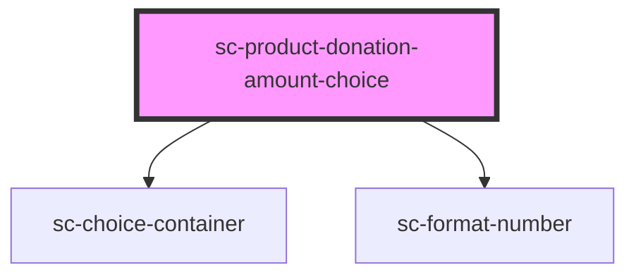

# sc-product-donation-amount-choice

<!-- Auto Generated Below -->

## Properties

| Property    | Attribute    | Description                    | Type     | Default     |
| ----------- | ------------ | ------------------------------ | -------- | ----------- |
| `label`     | `label`      | The label for the field.       | `string` | `undefined` |
| `productId` | `product-id` | The product id for the fields. | `string` | `undefined` |
| `value`     | `value`      | The value of the field.        | `number` | `undefined` |

## Dependencies

### Depends on

- [sc-choice-container](../../../ui/choice-container)
- [sc-format-number](../../../util/format-number)

### Graph

----------------------------------------------

*Built with [StencilJS](https://stenciljs.com/)*
