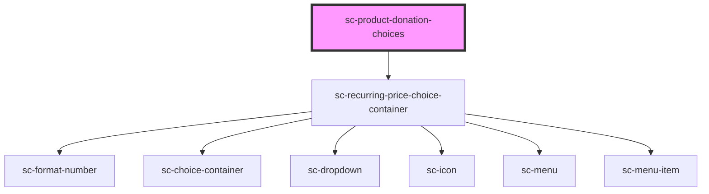

# sc-donation-choices-new

<!-- Auto Generated Below -->

## Properties

| Property    | Attribute    | Description                    | Type      | Default     |
| ----------- | ------------ | ------------------------------ | --------- | ----------- |
| `label`     | `label`      | The label for the field.       | `string`  | `undefined` |
| `productId` | `product-id` | The product id for the fields. | `string`  | `undefined` |
| `recurring` | `recurring`  |                                | `boolean` | `undefined` |

## Dependencies

### Depends on

- [sc-recurring-price-choice-container](../../../ui/sc-recurring-price-choice-container)

### Graph

----------------------------------------------

*Built with [StencilJS](https://stenciljs.com/)*
