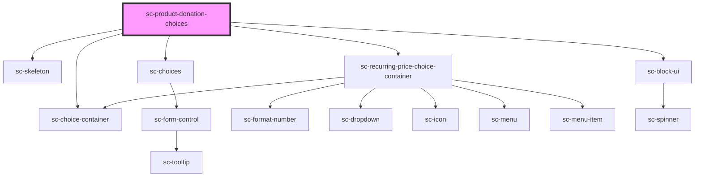

# sc-donation-choices-new

<!-- Auto Generated Below -->

## Properties

| Property                  | Attribute                    | Description                     | Type       | Default     |
| ------------------------- | ---------------------------- | ------------------------------- | ---------- | ----------- |
| `amountColumns`           | `amount-columns`             | The label for the field.        | `string`   | `undefined` |
| `amountLabel`             | `amount-label`               | The label for the field.        | `string`   | `undefined` |
| `busy`                    | `busy`                       |                                 | `boolean`  | `undefined` |
| `currencyCode`            | `currency-code`              | Currency code for the donation. | `string`   | `'usd'`     |
| `lineItem`                | --                           | Order line items.               | `LineItem` | `undefined` |
| `loading`                 | `loading`                    | Is this loading                 | `boolean`  | `undefined` |
| `nonRecurringChoiceLabel` | `non-recurring-choice-label` |                                 | `string`   | `undefined` |
| `priceId`                 | `price-id`                   | The price id for the fields.    | `string`   | `undefined` |
| `product`                 | `product`                    | The product id for the fields.  | `string`   | `undefined` |
| `recurringChoiceLabel`    | `recurring-choice-label`     |                                 | `string`   | `undefined` |
| `recurringLabel`          | `recurring-label`            | The label for the field.        | `string`   | `undefined` |
| `selectedProduct`         | --                           |                                 | `Product`  | `undefined` |

## Events

| Event              | Description            | Type                        |
| ------------------ | ---------------------- | --------------------------- |
| `scToggleLineItem` | Toggle line item event | `CustomEvent<LineItemData>` |

## Shadow Parts

| Part        | Description |
| ----------- | ----------- |
| `"base"`    |             |
| `"choice"`  |             |
| `"choices"` |             |

## Dependencies

### Depends on

- [sc-skeleton](../../../ui/skeleton)
- [sc-choices](../../../ui/choices)
- [sc-recurring-price-choice-container](../../../ui/sc-recurring-price-choice-container)
- [sc-choice-container](../../../ui/choice-container)
- [sc-block-ui](../../../ui/block-ui)

### Graph

----------------------------------------------

*Built with [StencilJS](https://stenciljs.com/)*
