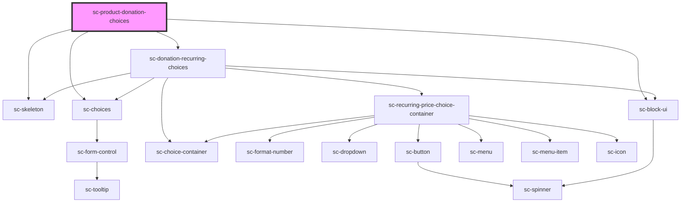

# sc-donation-choices-new

<!-- Auto Generated Below -->

## Properties

| Property                  | Attribute                 | Description                     | Type       | Default     |
| ------------------------- | ------------------------- | ------------------------------- | ---------- | ----------- |
| `amountcolumns`           | `amountcolumns`           | The label for the field.        | `string`   | `undefined` |
| `amountlabel`             | `amountlabel`             | The label for the field.        | `string`   | `undefined` |
| `busy`                    | `busy`                    |                                 | `boolean`  | `undefined` |
| `currencyCode`            | `currency-code`           | Currency code for the donation. | `string`   | `'usd'`     |
| `lineItem`                | --                        | Order line items.               | `LineItem` | `undefined` |
| `loading`                 | `loading`                 | Is this loading                 | `boolean`  | `undefined` |
| `nonrecurringchoicelabel` | `nonrecurringchoicelabel` |                                 | `string`   | `undefined` |
| `priceId`                 | `price-id`                | The price id for the fields.    | `string`   | `undefined` |
| `product`                 | `product`                 | The product id for the fields.  | `string`   | `undefined` |
| `recurringchoicelabel`    | `recurringchoicelabel`    |                                 | `string`   | `undefined` |
| `recurringlabel`          | `recurringlabel`          | The label for the field.        | `string`   | `undefined` |
| `selectedProduct`         | --                        |                                 | `Product`  | `undefined` |

## Events

| Event              | Description            | Type                        |
| ------------------ | ---------------------- | --------------------------- |
| `scToggleLineItem` | Toggle line item event | `CustomEvent<LineItemData>` |

## Shadow Parts

| Part                  | Description |
| --------------------- | ----------- |
| `"recurring-choices"` |             |

## Dependencies

### Depends on

- [sc-skeleton](../../../ui/skeleton)
- [sc-choices](../../../ui/choices)
- [sc-donation-recurring-choices](../donation-recurring-choices)
- [sc-block-ui](../../../ui/block-ui)

### Graph

----------------------------------------------

*Built with [StencilJS](https://stenciljs.com/)*
