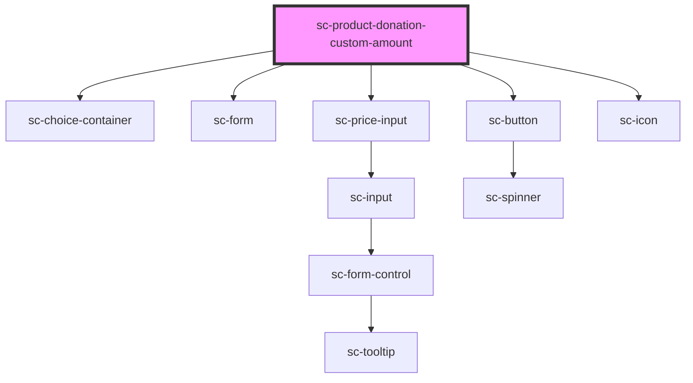

# sc-custom-donation-amount

<!-- Auto Generated Below -->

## Properties

| Property       | Attribute       | Description                           | Type     | Default     |
| -------------- | --------------- | ------------------------------------- | -------- | ----------- |
| `currencyCode` | `currency-code` | Currency code for the donation.       | `string` | `'usd'`     |
| `productId`    | `product-id`    | Selected Product Id for the donation. | `string` | `undefined` |
| `value`        | `value`         | Custom Amount of the donation.        | `number` | `undefined` |

## Dependencies

### Depends on

- [sc-choice-container](../../../ui/choice-container)
- [sc-form](../../../ui/form)
- [sc-price-input](../../../ui/price-input)
- [sc-button](../../../ui/button)
- [sc-icon](../../../ui/icon)

### Graph

----------------------------------------------

*Built with [StencilJS](https://stenciljs.com/)*
