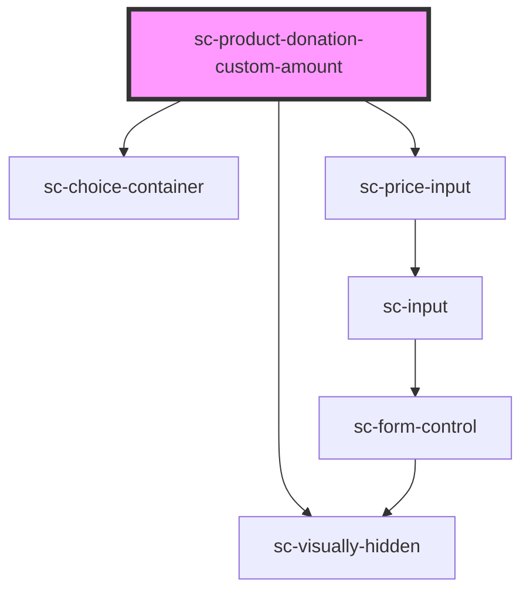

# sc-custom-donation-amount

<!-- Auto Generated Below -->

## Properties

| Property    | Attribute    | Description                           | Type     | Default     |
| ----------- | ------------ | ------------------------------------- | -------- | ----------- |
| `productId` | `product-id` | Selected Product Id for the donation. | `string` | `undefined` |
| `value`     | `value`      | Custom Amount of the donation.        | `number` | `undefined` |

## Dependencies

### Depends on

- [sc-choice-container](../../../ui/choice-container)
- [sc-visually-hidden](../../../util/visually-hidden)
- [sc-price-input](../../../ui/price-input)

### Graph

----------------------------------------------

*Built with [StencilJS](https://stenciljs.com/)*
