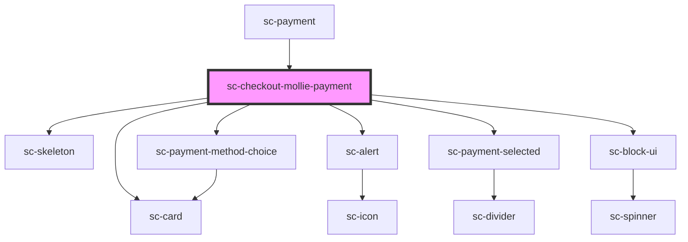

# sc-checkout-mollie-payment

<!-- Auto Generated Below -->

## Properties

| Property      | Attribute      | Description | Type     | Default     |
| ------------- | -------------- | ----------- | -------- | ----------- |
| `method`      | `method`       |             | `string` | `undefined` |
| `processorId` | `processor-id` |             | `string` | `undefined` |

## Events

| Event     | Description | Type                         |
| --------- | ----------- | ---------------------------- |
| `scError` | Error event | `CustomEvent<ResponseError>` |

## Dependencies

### Used by

 - [sc-payment](../payment)

### Depends on

- [sc-card](../../../ui/card)
- [sc-skeleton](../../../ui/skeleton)
- [sc-alert](../../../ui/alert)
- [sc-payment-method-choice](../../../processors/sc-payment-method-choice)
- [sc-payment-selected](../../../ui/payment-selected)
- [sc-block-ui](../../../ui/block-ui)

### Graph

----------------------------------------------

*Built with [StencilJS](https://stenciljs.com/)*
