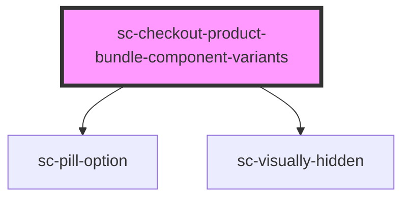

# sc-checkout-product-bundle-component-variants

<!-- Auto Generated Below -->

## Overview

Checkout-side picker for bundle component variants. Mirrors the PDP bundle
picker (the scope-aware `surecart/product-variant-pills` block) but writes the
selection straight into the bundle line item's `bundle_component_variants`.

## Properties

| Property  | Attribute | Description                                                                                    | Type      | Default     |
| --------- | --------- | ---------------------------------------------------------------------------------------------- | --------- | ----------- |
| `product` | --        | The bundle product (must include bundle_items.component_variants + component_variant_options). | `Product` | `undefined` |

## Dependencies

### Depends on

- [sc-pill-option](../../../ui/pill-option)
- [sc-visually-hidden](../../../util/visually-hidden)

### Graph

----------------------------------------------

*Built with [StencilJS](https://stenciljs.com/)*
