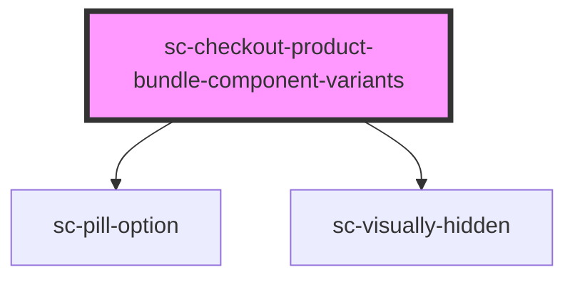

# sc-checkout-product-bundle-component-variants

<!-- Auto Generated Below -->

## Overview

Instant-checkout-side picker for bundle component variants.

Mirrors the PDP's `surecart/product-bundle-items` block but writes its
selection straight into the existing bundle line item's
`bundle_component_variants`, so the buy page can keep its Stencil-only
checkout flow.

## Properties

| Property  | Attribute | Description                                                                                | Type      | Default     |
| --------- | --------- | ------------------------------------------------------------------------------------------ | --------- | ----------- |
| `product` | --        | The bundle product (must include bundle_items.component_product variants/variant_options). | `Product` | `undefined` |

## Dependencies

### Depends on

- [sc-pill-option](../../../ui/pill-option)
- [sc-visually-hidden](../../../util/visually-hidden)

### Graph

----------------------------------------------

*Built with [StencilJS](https://stenciljs.com/)*
