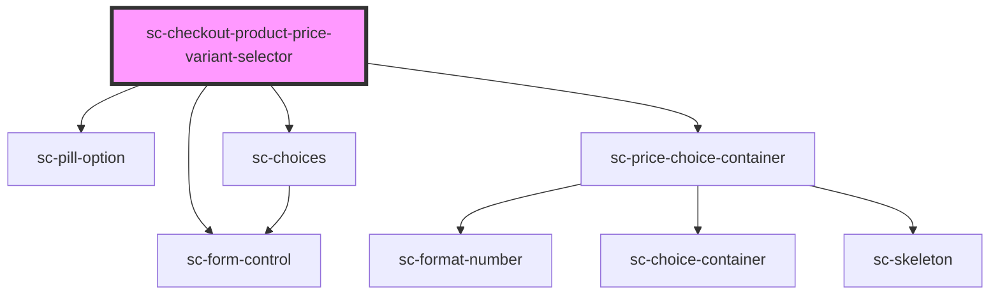

# sc-checkout-product-price-variant-selector

<!-- Auto Generated Below -->

## Properties

| Property  | Attribute | Description              | Type      | Default     |
| --------- | --------- | ------------------------ | --------- | ----------- |
| `label`   | `label`   | The label for the price. | `string`  | `undefined` |
| `product` | --        | The product.             | `Product` | `undefined` |

## Methods

### `reportValidity() => Promise<boolean>`

#### Returns

Type: `Promise<boolean>`

## Dependencies

### Depends on

- [sc-form-control](../../../ui/form-control)
- [sc-pill-option](../../../ui/pill-option)
- [sc-choices](../../../ui/choices)
- [sc-price-choice-container](../../../ui/sc-price-choice-container)

### Graph

----------------------------------------------

*Built with [StencilJS](https://stenciljs.com/)*
