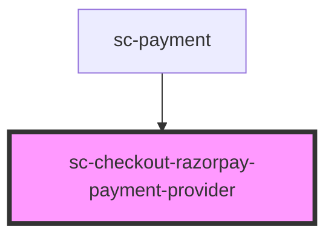

# sc-checkout-razorpay-payment-provider

<!-- Auto Generated Below -->

## Properties

| Property      | Attribute      | Description                                                                     | Type     | Default     |
| ------------- | -------------- | ------------------------------------------------------------------------------- | -------- | ----------- |
| `processorId` | `processor-id` | Razorpay processor id. Required for the recurring `payment_method_types` fetch. | `string` | `undefined` |

## Dependencies

### Used by

 - [sc-payment](../payment)

### Graph

----------------------------------------------

*Built with [StencilJS](https://stenciljs.com/)*
