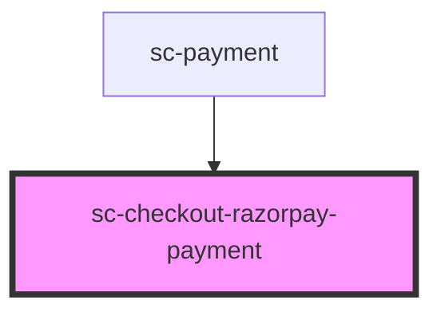

# sc-checkout-razorpay-payment

<!-- Auto Generated Below -->

## Overview

Headless fetcher — keeps Razorpay's available payment methods in sync with the checkout.

Razorpay requires an explicit `payment_method_type` when creating a recurring order; it
can't fan methods out automatically the way one-time checkouts do. This component calls
the same `processors/:id/payment_method_types` endpoint Mollie uses and writes the filtered
list into `processorsState.methods`. The actual `sc-payment-method-choice` elements are
rendered by `sc-payment` itself so they stay as direct siblings of the other processors
(stripe/mock/etc.) — that's what keeps the sibling-detection-driven toggle behaviour
correct. If we rendered them inside this component's shadow root, each choice would lose
sight of its siblings and fall back to an always-open `div`.

Intentionally renders nothing.

## Properties

| Property      | Attribute      | Description | Type     | Default     |
| ------------- | -------------- | ----------- | -------- | ----------- |
| `processorId` | `processor-id` |             | `string` | `undefined` |

## Dependencies

### Used by

 - [sc-payment](../payment)

### Graph

----------------------------------------------

*Built with [StencilJS](https://stenciljs.com/)*
