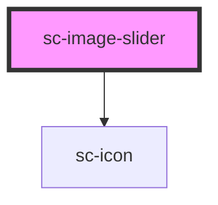

# sc-product-image-carousel

<!-- Auto Generated Below -->

## Properties

| Property            | Attribute             | Description                            | Type                                        | Default     |
| ------------------- | --------------------- | -------------------------------------- | ------------------------------------------- | ----------- |
| `autoHeight`        | `auto-height`         |                                        | `boolean`                                   | `undefined` |
| `images`            | `images`              | Accept a string or an array of objects | `string \| { src: string; alt: string; }[]` | `undefined` |
| `thumbnails`        | `thumbnails`          |                                        | `boolean`                                   | `undefined` |
| `thumbnailsPerPage` | `thumbnails-per-page` |                                        | `number`                                    | `5`         |

## Shadow Parts

| Part     | Description |
| -------- | ----------- |
| `"base"` |             |

## Dependencies

### Depends on

- [sc-icon](../../../ui/icon)

### Graph

----------------------------------------------

*Built with [StencilJS](https://stenciljs.com/)*
