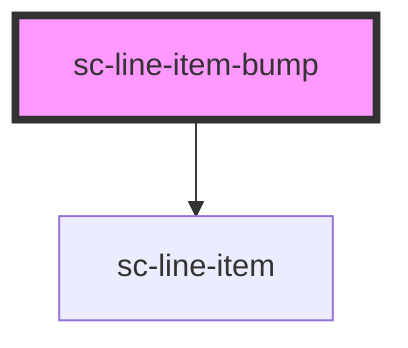

# sc-line-item-bump

<!-- Auto Generated Below -->

## Properties

| Property  | Attribute | Description | Type      | Default     |
| --------- | --------- | ----------- | --------- | ----------- |
| `label`   | `label`   |             | `string`  | `undefined` |
| `loading` | `loading` |             | `boolean` | `undefined` |

## Dependencies

### Depends on

- [sc-line-item](../../../ui/line-item)

### Graph

----------------------------------------------

*Built with [StencilJS](https://stenciljs.com/)*
