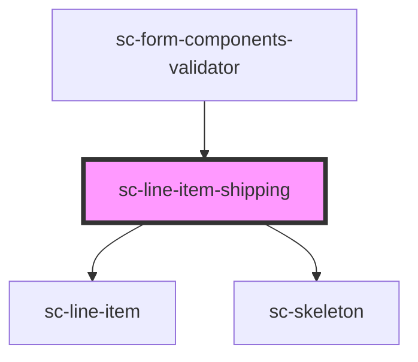

# sc-shipping-amount

<!-- Auto Generated Below -->

## Properties

| Property | Attribute | Description | Type     | Default     |
| -------- | --------- | ----------- | -------- | ----------- |
| `label`  | `label`   | Label       | `string` | `undefined` |

## Dependencies

### Used by

 - [sc-form-components-validator](../../../providers/form-components-validator)

### Depends on

- [sc-line-item](../../../ui/line-item)
- [sc-skeleton](../../../ui/skeleton)

### Graph

----------------------------------------------

*Built with [StencilJS](https://stenciljs.com/)*
