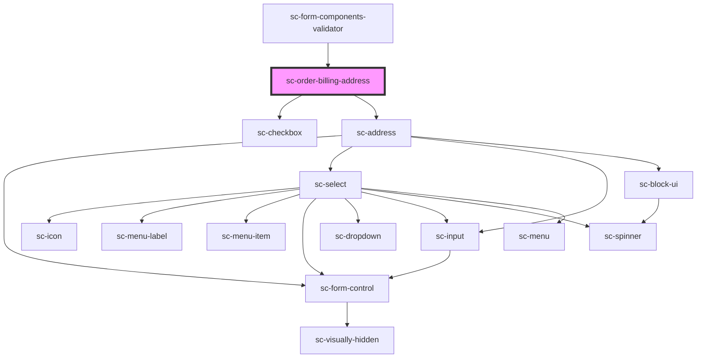

# sc-order-billing-address

<!-- Auto Generated Below -->

## Properties

| Property          | Attribute          | Description                 | Type      | Default                                                 |
| ----------------- | ------------------ | --------------------------- | --------- | ------------------------------------------------------- |
| `defaultCountry`  | `default-country`  | Default country for address | `string`  | `undefined`                                             |
| `label`           | `label`            | Label for the field         | `string`  | `undefined`                                             |
| `namePlaceholder` | `name-placeholder` | Name placeholder            | `string`  | `__('Name or Company Name', 'surecart')`                |
| `showName`        | `show-name`        | Show the name field         | `boolean` | `undefined`                                             |
| `toggleLabel`     | `toggle-label`     | Toggle label                | `string`  | `__('Billing address is same as shipping', 'surecart')` |

## Methods

### `reportValidity() => Promise<boolean>`

#### Returns

Type: `Promise<boolean>`

## Dependencies

### Used by

 - [sc-form-components-validator](../../../providers/form-components-validator)

### Depends on

- [sc-checkbox](../../../ui/checkbox)
- [sc-address](../../../ui/address)

### Graph

----------------------------------------------

*Built with [StencilJS](https://stenciljs.com/)*
