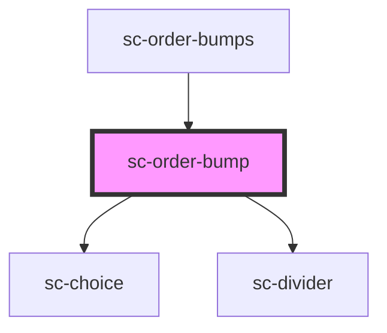

# sc-order-bump

<!-- Auto Generated Below -->

## Properties

| Property      | Attribute      | Description                 | Type      | Default     |
| ------------- | -------------- | --------------------------- | --------- | ----------- |
| `bump`        | --             | The bump                    | `Bump`    | `undefined` |
| `showControl` | `show-control` | Should we show the controls | `boolean` | `undefined` |

## Shadow Parts

| Part             | Description |
| ---------------- | ----------- |
| `"base-content"` |             |
| `"price"`        |             |

## Dependencies

### Used by

 - [sc-order-bumps](../sc-order-bumps)

### Depends on

- [sc-choice](../../../ui/choice)
- [sc-divider](../../../ui/divider)

### Graph

----------------------------------------------

*Built with [StencilJS](https://stenciljs.com/)*
