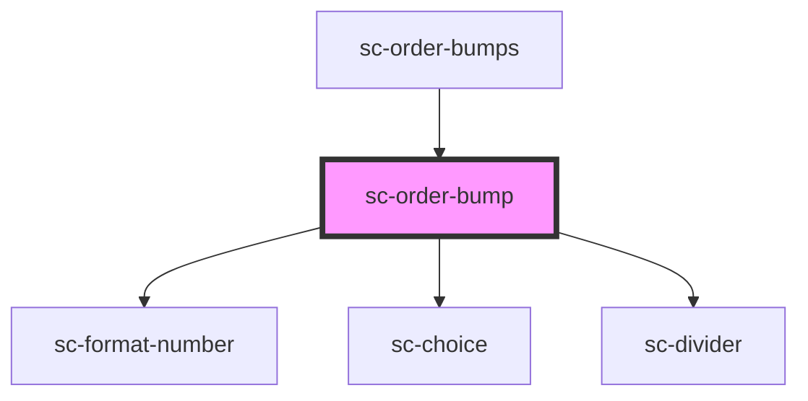

# sc-order-bump

<!-- Auto Generated Below -->

## Properties

| Property      | Attribute      | Description  | Type       | Default     |
| ------------- | -------------- | ------------ | ---------- | ----------- |
| `bump`        | --             | The bump     | `Bump`     | `undefined` |
| `checkout`    | --             | The checkout | `Checkout` | `undefined` |
| `showControl` | `show-control` |              | `boolean`  | `undefined` |
| `showLabel`   | `show-label`   |              | `boolean`  | `undefined` |

## Events

| Event              | Description            | Type                        |
| ------------------ | ---------------------- | --------------------------- |
| `scAddLineItem`    | Add line item event    | `CustomEvent<LineItemData>` |
| `scRemoveLineItem` | Remove line item event | `CustomEvent<LineItemData>` |

## Shadow Parts

| Part             | Description |
| ---------------- | ----------- |
| `"base-content"` |             |
| `"price"`        |             |

## Dependencies

### Used by

 - [sc-order-bumps](../sc-order-bumps)

### Depends on

- [sc-format-number](../../../util/format-number)
- [sc-choice](../../../ui/choice)
- [sc-divider](../../../ui/divider)

### Graph

----------------------------------------------

*Built with [StencilJS](https://stenciljs.com/)*
