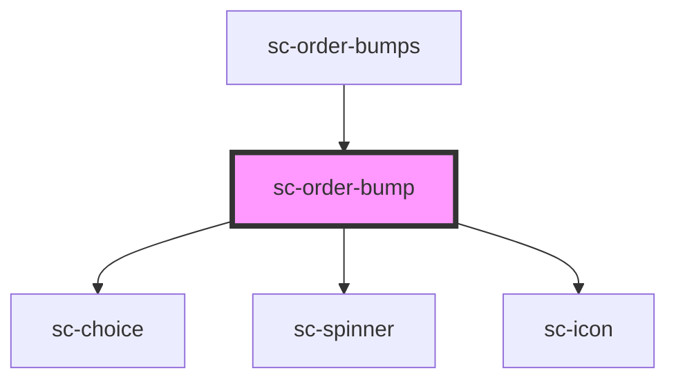

# sc-order-bump

<!-- Auto Generated Below -->

## Properties

| Property | Attribute | Description | Type   | Default     |
| -------- | --------- | ----------- | ------ | ----------- |
| `bump`   | --        | The bump    | `Bump` | `undefined` |

## Shadow Parts

| Part             | Description |
| ---------------- | ----------- |
| `"base-content"` |             |
| `"price"`        |             |

## Dependencies

### Used by

 - [sc-order-bumps](../sc-order-bumps)

### Depends on

- [sc-choice](../../../ui/choice)
- [sc-spinner](../../../ui/spinner)
- [sc-icon](../../../ui/icon)

### Graph

```mermaid
graph TD;
  sc-order-bump --> sc-choice
  sc-order-bump --> sc-spinner
  sc-order-bump --> sc-icon
  sc-order-bumps --> sc-order-bump
  style sc-order-bump fill:#f9f,stroke:#333,stroke-width:4px
```

----------------------------------------------

*Built with [StencilJS](https://stenciljs.com/)*
