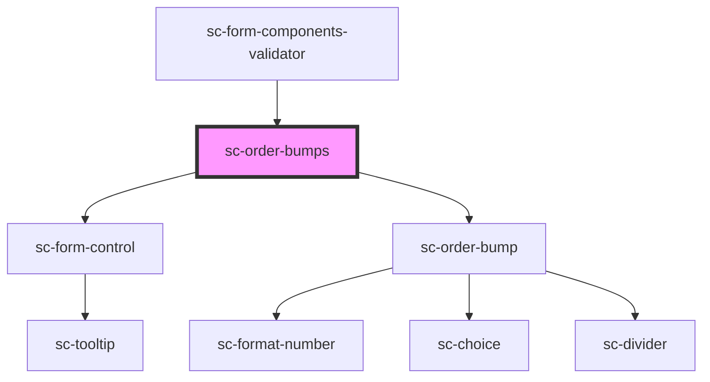

# sc-order-bumps

<!-- Auto Generated Below -->

## Properties

| Property   | Attribute | Description | Type       | Default     |
| ---------- | --------- | ----------- | ---------- | ----------- |
| `bumps`    | --        |             | `Bump[]`   | `undefined` |
| `checkout` | --        |             | `Checkout` | `undefined` |
| `help`     | `help`    |             | `string`   | `undefined` |
| `label`    | `label`   |             | `string`   | `undefined` |

## Dependencies

### Used by

 - [sc-form-components-validator](../../../providers/form-components-validator)

### Depends on

- [sc-form-control](../../../ui/form-control)
- [sc-order-bump](../sc-order-bump)

### Graph

----------------------------------------------

*Built with [StencilJS](https://stenciljs.com/)*
