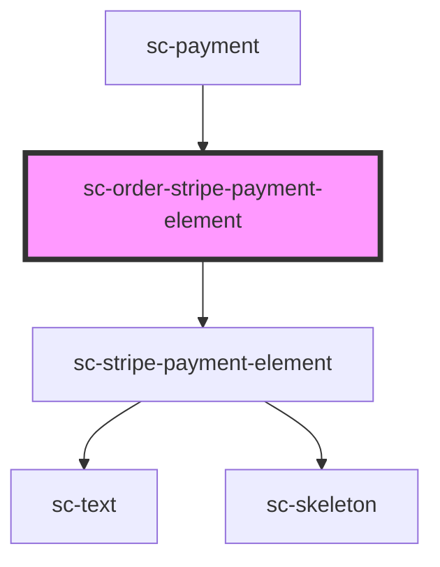

# sc-order-stripe-payment-element

<!-- Auto Generated Below -->

## Properties

| Property       | Attribute       | Description                                | Type               | Default     |
| -------------- | --------------- | ------------------------------------------ | ------------------ | ----------- |
| `address`      | `address`       | Should we collect an address?              | `boolean`          | `undefined` |
| `currencyCode` | `currency-code` | The currency code for the payment element. | `string`           | `'usd'`     |
| `mode`         | `mode`          | Payment mode.                              | `"live" \| "test"` | `'live'`    |
| `order`        | --              | The order.                                 | `Order`            | `undefined` |
| `processors`   | --              | Available processors                       | `Processor[]`      | `[]`        |

## Events

| Event                | Description | Type                                                                   |
| -------------------- | ----------- | ---------------------------------------------------------------------- |
| `scPaid`             |             | `CustomEvent<void>`                                                    |
| `scPayError`         |             | `CustomEvent<any>`                                                     |
| `scSetPaymentIntent` |             | `CustomEvent<{ processor: "stripe"; payment_intent: PaymentIntent; }>` |

## Dependencies

### Used by

 - [sc-payment](../payment)

### Depends on

- [sc-stripe-payment-element](../../../ui/stripe-payment-element)

### Graph

----------------------------------------------

*Built with [StencilJS](https://stenciljs.com/)*
