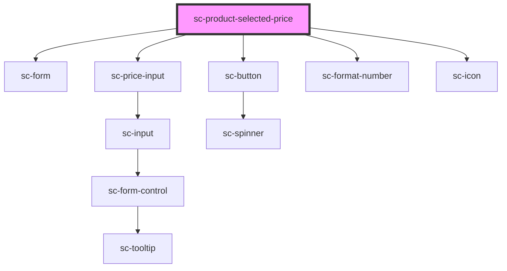

# sc-product-selected-price

<!-- Auto Generated Below -->

## Properties

| Property    | Attribute    | Description     | Type     | Default     |
| ----------- | ------------ | --------------- | -------- | ----------- |
| `productId` | `product-id` | The product id. | `string` | `undefined` |

## Events

| Event              | Description            | Type                        |
| ------------------ | ---------------------- | --------------------------- |
| `scUpdateLineItem` | Toggle line item event | `CustomEvent<LineItemData>` |

## Shadow Parts

| Part               | Description |
| ------------------ | ----------- |
| `"price__scratch"` |             |

## Dependencies

### Depends on

- [sc-form](../../../ui/form)
- [sc-price-input](../../../ui/price-input)
- [sc-button](../../../ui/button)
- [sc-format-number](../../../util/format-number)
- [sc-icon](../../../ui/icon)

### Graph

----------------------------------------------

*Built with [StencilJS](https://stenciljs.com/)*
