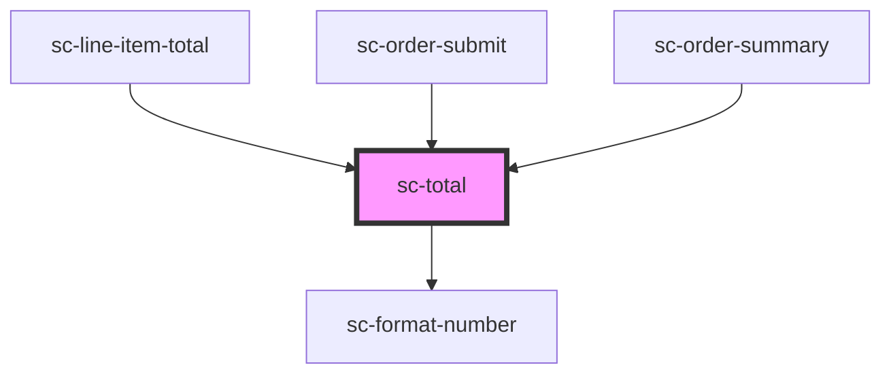

# ce-total

<!-- Auto Generated Below -->

## Properties

| Property | Attribute | Description | Type                                    | Default        |
| -------- | --------- | ----------- | --------------------------------------- | -------------- |
| `order`  | --        |             | `Checkout`                              | `undefined`    |
| `total`  | `total`   |             | `"amount_due" \| "subtotal" \| "total"` | `'amount_due'` |

## Dependencies

### Used by

 - [sc-line-item-total](../line-item-total)
 - [sc-order-submit](../order-submit)
 - [sc-order-summary](../order-summary)

### Depends on

- [sc-format-number](../../../util/format-number)

### Graph

----------------------------------------------

*Built with [StencilJS](https://stenciljs.com/)*
