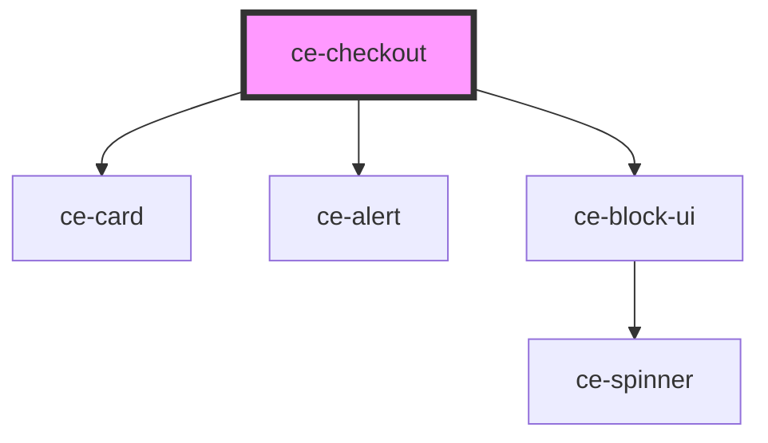

# ce-checkout

<!-- Auto Generated Below -->

## Properties

| Property               | Attribute                | Description                                   | Type                              | Default                                 |
| ---------------------- | ------------------------ | --------------------------------------------- | --------------------------------- | --------------------------------------- |
| `alignment`            | `alignment`              | Alignment                                     | `"center" \| "full" \| "wide"`    | `undefined`                             |
| `choiceType`           | `choice-type`            | Give a user a choice to switch session prices | `"all" \| "multiple" \| "single"` | `'all'`                                 |
| `coupon`               | --                       | Optionally pass a coupon.                     | `Coupon`                          | `undefined`                             |
| `currencyCode`         | `currency-code`          | Currency to use for this checkout.            | `string`                          | `'usd'`                                 |
| `i18n`                 | --                       | Translation object.                           | `Object`                          | `undefined`                             |
| `keys`                 | --                       | Publishable keys for providers                | `Keys`                            | `{     stripe: '',     paypal: '',   }` |
| `lineItemData`         | --                       | Pass line item data to create with session.   | `LineItemData[]`                  | `undefined`                             |
| `productsChoices`      | --                       | Pass an array of products                     | `ProductChoices`                  | `undefined`                             |
| `stripePublishableKey` | `stripe-publishable-key` | Stripe publishable key                        | `string`                          | `undefined`                             |
| `successUrl`           | `success-url`            | Where to go on success                        | `string`                          | `''`                                    |

## Dependencies

### Depends on

- [ce-card](../../ui/card)
- [ce-alert](../../ui/alert)
- [ce-block-ui](../../ui/block-ui)

### Graph

----------------------------------------------

*Built with [StencilJS](https://stenciljs.com/)*
