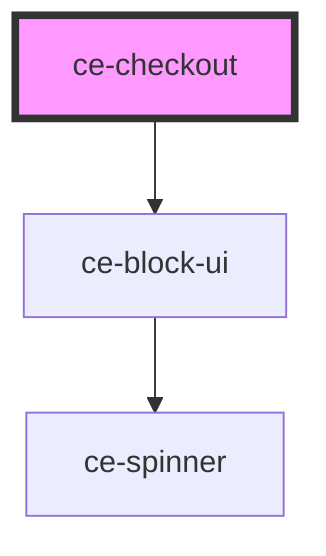

# ce-checkout

<!-- Auto Generated Below -->

## Properties

| Property               | Attribute                | Description                                               | Type             | Default                                 |
| ---------------------- | ------------------------ | --------------------------------------------------------- | ---------------- | --------------------------------------- |
| `choicePriceIds`       | --                       | Pass an array of ids for choice fields                    | `string[]`       | `undefined`                             |
| `choices`              | --                       | Pass an array of choices                                  | `ProductChoices` | `undefined`                             |
| `coupon`               | --                       | Optionally pass a coupon.                                 | `Coupon`         | `undefined`                             |
| `currencyCode`         | `currency-code`          | Currency to use for this checkout.                        | `string`         | `'usd'`                                 |
| `i18n`                 | --                       | Translation object.                                       | `Object`         | `undefined`                             |
| `keys`                 | --                       | Publishable keys for providers                            | `Keys`           | `{     stripe: '',     paypal: '',   }` |
| `lineItemData`         | --                       | Pass line item data to create with session.               | `LineItemData[]` | `undefined`                             |
| `priceData`            | --                       | Pass an array of price information to load into the form. | `PriceData[]`    | `undefined`                             |
| `stripePublishableKey` | `stripe-publishable-key` | Stripe publishable key                                    | `string`         | `undefined`                             |

## Dependencies

### Depends on

- [ce-block-ui](../../ui/block-ui)

### Graph

----------------------------------------------

*Built with [StencilJS](https://stenciljs.com/)*
