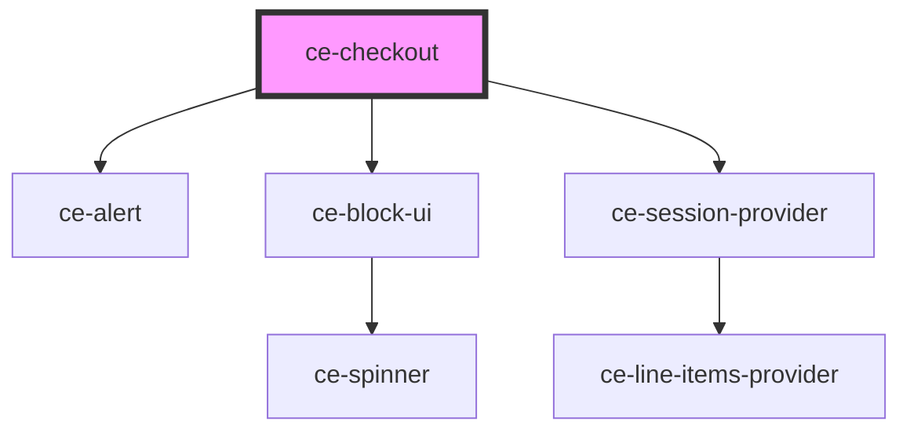

# ce-checkout

<!-- Auto Generated Below -->

## Properties

| Property         | Attribute         | Description                                 | Type                           | Default                                 |
| ---------------- | ----------------- | ------------------------------------------- | ------------------------------ | --------------------------------------- |
| `alignment`      | `alignment`       | Alignment                                   | `"center" \| "full" \| "wide"` | `undefined`                             |
| `coupon`         | --                | Optionally pass a coupon.                   | `Coupon`                       | `undefined`                             |
| `currencyCode`   | `currency-code`   | Currency to use for this checkout.          | `string`                       | `'usd'`                                 |
| `customer`       | --                | Stores the current customer                 | `Customer`                     | `undefined`                             |
| `formId`         | `form-id`         | The checkout form id                        | `number`                       | `undefined`                             |
| `i18n`           | --                | Translation object.                         | `Object`                       | `undefined`                             |
| `keys`           | --                | Publishable keys for providers              | `Keys`                         | `{     stripe: '',     paypal: '',   }` |
| `mode`           | `mode`            | Are we in test or live mode.                | `"live" \| "test"`             | `'live'`                                |
| `persistSession` | `persist-session` | Where to go on success                      | `boolean`                      | `true`                                  |
| `prices`         | --                | An array of prices to pre-fill in the form. | `PriceChoice[]`                | `[]`                                    |
| `successUrl`     | `success-url`     | Where to go on success                      | `string`                       | `''`                                    |

## Dependencies

### Depends on

- [ce-alert](../../ui/alert)
- [ce-block-ui](../../ui/block-ui)
- [ce-session-provider](../../providers/session-provider)

### Graph

----------------------------------------------

*Built with [StencilJS](https://stenciljs.com/)*
