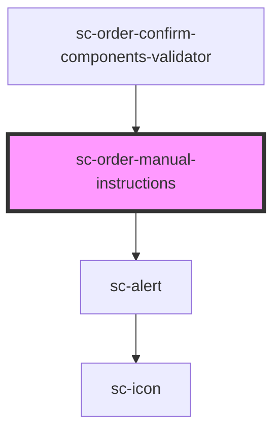

# sc-order-manual-instructions

<!-- Auto Generated Below -->

## Properties

| Property                    | Attribute                     | Description | Type     | Default     |
| --------------------------- | ----------------------------- | ----------- | -------- | ----------- |
| `manualPaymentInstructions` | `manual-payment-instructions` |             | `string` | `undefined` |
| `manualPaymentTitle`        | `manual-payment-title`        |             | `string` | `undefined` |

## Dependencies

### Used by

 - [sc-order-confirm-components-validator](../../../providers/sc-order-confirm-components-validator)

### Depends on

- [sc-alert](../../../ui/alert)

### Graph

----------------------------------------------

*Built with [StencilJS](https://stenciljs.com/)*
