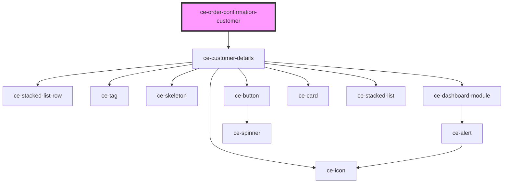

# ce-order-confirmation-customer

<!-- Auto Generated Below -->

## Properties

| Property   | Attribute | Description      | Type       | Default     |
| ---------- | --------- | ---------------- | ---------- | ----------- |
| `customer` | --        | The customer     | `Customer` | `undefined` |
| `error`    | `error`   | Error message.   | `string`   | `undefined` |
| `heading`  | `heading` | The heading      | `string`   | `undefined` |
| `loading`  | `loading` | Is this loading? | `boolean`  | `undefined` |
| `order`    | --        | The Order        | `Order`    | `undefined` |

## Dependencies

### Depends on

- [ce-customer-details](../../../ui/customer-details)

### Graph

----------------------------------------------

*Built with [StencilJS](https://stenciljs.com/)*
