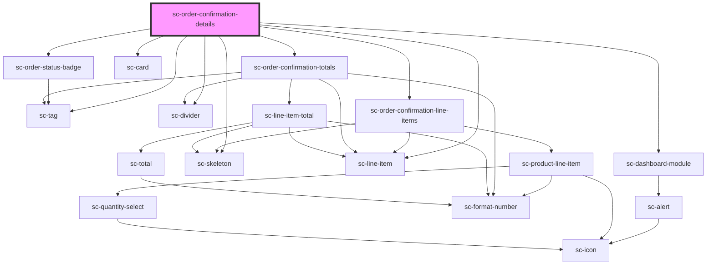

# sc-order-confirmation-details

<!-- Auto Generated Below -->

## Properties

| Property  | Attribute | Description | Type      | Default     |
| --------- | --------- | ----------- | --------- | ----------- |
| `loading` | `loading` |             | `boolean` | `undefined` |
| `order`   | --        |             | `Order`   | `undefined` |

## Dependencies

### Depends on

- [sc-tag](../../../ui/tag)
- [sc-order-status-badge](../../../ui/order-status-badge)
- [sc-dashboard-module](../../../ui/dashboard-module)
- [sc-skeleton](../../../ui/skeleton)
- [sc-card](../../../ui/card)
- [sc-line-item](../../../ui/line-item)
- [sc-divider](../../../ui/divider)
- [sc-order-confirmation-line-items](../order-confirmation-line-items)
- [sc-order-confirmation-totals](../order-confirmation-totals)

### Graph

----------------------------------------------

*Built with [StencilJS](https://stenciljs.com/)*
