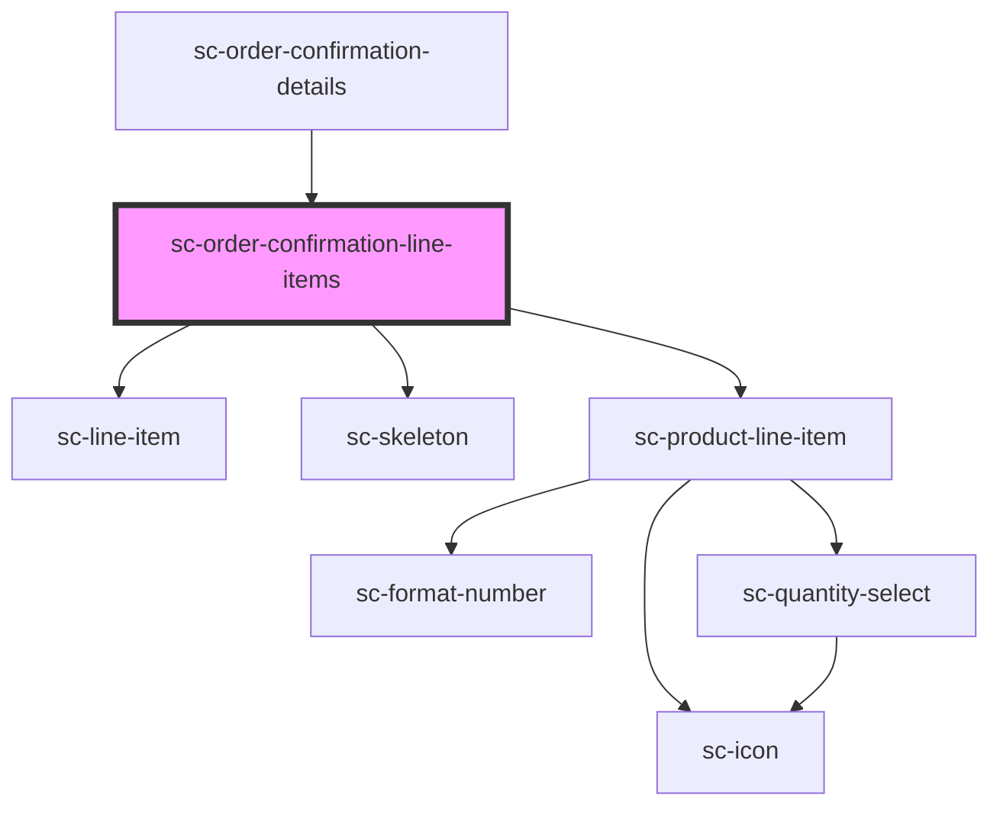

# ce-order-confirmation-line-items

<!-- Auto Generated Below -->

## Properties

| Property  | Attribute | Description | Type      | Default     |
| --------- | --------- | ----------- | --------- | ----------- |
| `loading` | `loading` |             | `boolean` | `undefined` |
| `order`   | --        |             | `Order`   | `undefined` |

## Shadow Parts

| Part           | Description |
| -------------- | ----------- |
| `"line-items"` |             |

## Dependencies

### Used by

 - [sc-order-confirmation-details](../order-confirmation-details)

### Depends on

- [sc-line-item](../../../ui/line-item)
- [sc-skeleton](../../../ui/skeleton)
- [sc-product-line-item](../../../ui/product-line-item)

### Graph

----------------------------------------------

*Built with [StencilJS](https://stenciljs.com/)*
