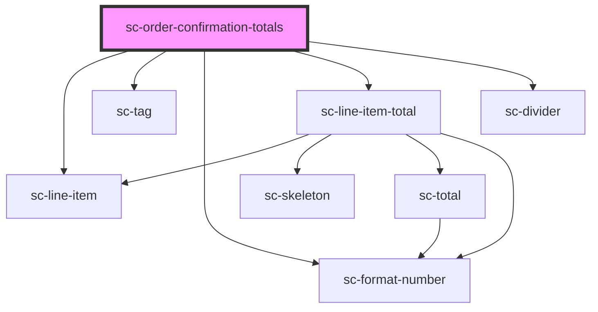

# ce-order-confirmation-totals

<!-- Auto Generated Below -->

## Properties

| Property | Attribute | Description | Type    | Default     |
| -------- | --------- | ----------- | ------- | ----------- |
| `order`  | --        |             | `Order` | `undefined` |

## Dependencies

### Depends on

- [sc-line-item](../../../ui/line-item)
- [sc-tag](../../../ui/tag)
- [sc-format-number](../../../util/format-number)
- [sc-line-item-total](../../checkout-form/line-item-total)
- [sc-divider](../../../ui/divider)

### Graph

----------------------------------------------

*Built with [StencilJS](https://stenciljs.com/)*
