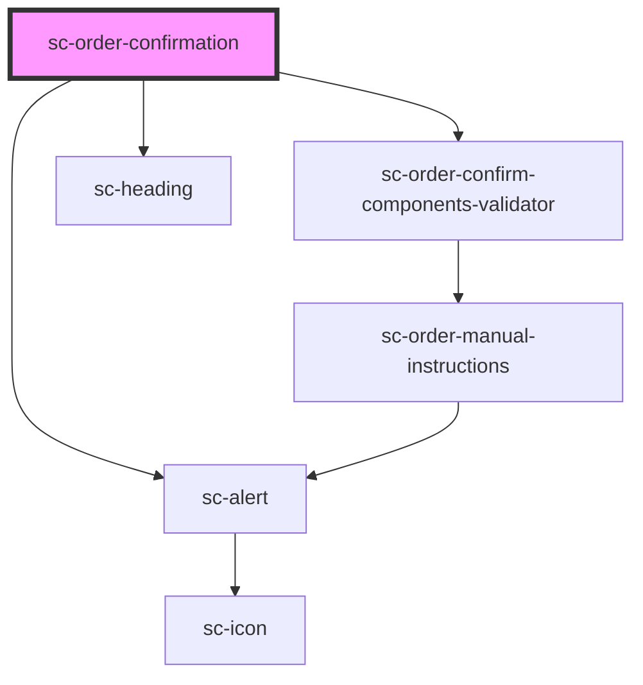

# ce-order-confirmation

<!-- Auto Generated Below -->

## Properties

| Property | Attribute | Description | Type       | Default     |
| -------- | --------- | ----------- | ---------- | ----------- |
| `order`  | --        |             | `Checkout` | `undefined` |

## Dependencies

### Depends on

- [sc-alert](../../../ui/alert)
- [sc-order-confirm-components-validator](../../../providers/sc-order-confirm-components-validator)
- [sc-heading](../../../ui/heading)

### Graph

----------------------------------------------

*Built with [StencilJS](https://stenciljs.com/)*
