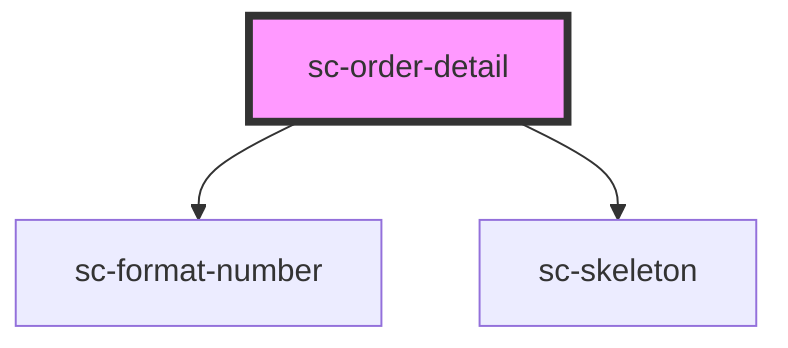

# ce-card

<!-- Auto Generated Below -->

## Properties

| Property   | Attribute  | Description | Type      | Default     |
| ---------- | ---------- | ----------- | --------- | ----------- |
| `fallback` | `fallback` |             | `string`  | `undefined` |
| `label`    | `label`    |             | `string`  | `undefined` |
| `loading`  | `loading`  |             | `boolean` | `undefined` |
| `metaKey`  | `meta-key` |             | `string`  | `undefined` |
| `order`    | --         |             | `Order`   | `undefined` |
| `value`    | `value`    |             | `string`  | `undefined` |

## Shadow Parts

| Part      | Description |
| --------- | ----------- |
| `"base"`  |             |
| `"label"` |             |
| `"value"` |             |

## Dependencies

### Depends on

- [sc-format-number](../../../util/format-number)
- [sc-skeleton](../../../ui/skeleton)

### Graph

----------------------------------------------

*Built with [StencilJS](https://stenciljs.com/)*
