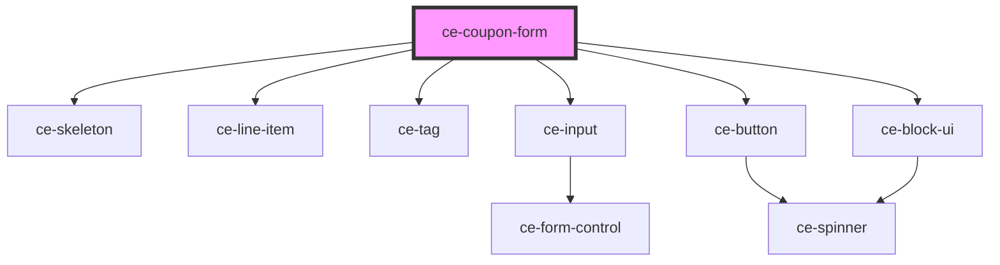

# ce-coupon-form

<!-- Auto Generated Below -->

## Properties

| Property          | Attribute     | Description | Type              | Default     |
| ----------------- | ------------- | ----------- | ----------------- | ----------- |
| `calculating`     | `calculating` |             | `boolean`         | `undefined` |
| `checkoutSession` | --            |             | `CheckoutSession` | `undefined` |
| `label`           | `label`       |             | `string`          | `undefined` |
| `loading`         | `loading`     |             | `boolean`         | `undefined` |

## Events

| Event           | Description | Type                  |
| --------------- | ----------- | --------------------- |
| `ceApplyCoupon` |             | `CustomEvent<string>` |

## Dependencies

### Depends on

- [ce-skeleton](../../ui/skeleton)
- [ce-line-item](../../ui/line-item)
- [ce-tag](../../ui/tag)
- [ce-input](../../ui/input)
- [ce-button](../../ui/button)
- [ce-block-ui](../../ui/block-ui)

### Graph

----------------------------------------------

*Built with [StencilJS](https://stenciljs.com/)*
