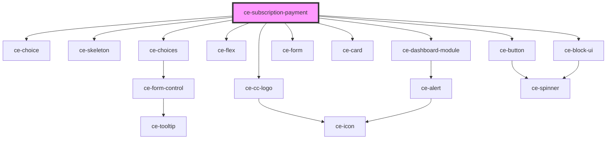

# ce-subscription-payment

<!-- Auto Generated Below -->

## Properties

| Property         | Attribute         | Description | Type              | Default     |
| ---------------- | ----------------- | ----------- | ----------------- | ----------- |
| `backUrl`        | `back-url`        |             | `string`          | `undefined` |
| `customerIds`    | --                |             | `string[]`        | `[]`        |
| `paymentMethods` | --                |             | `PaymentMethod[]` | `[]`        |
| `subscription`   | --                |             | `Subscription`    | `undefined` |
| `subscriptionId` | `subscription-id` |             | `string`          | `undefined` |
| `successUrl`     | `success-url`     |             | `string`          | `undefined` |

## Dependencies

### Depends on

- [ce-choice](../../../ui/choice)
- [ce-skeleton](../../../ui/skeleton)
- [ce-choices](../../../ui/choices)
- [ce-flex](../../../ui/flex)
- [ce-cc-logo](../../../ui/ce-cc-logo)
- [ce-dashboard-module](../../../ui/ce-dashboard-module)
- [ce-form](../../../ui/form)
- [ce-card](../../../ui/card)
- [ce-button](../../../ui/button)
- [ce-block-ui](../../../ui/block-ui)

### Graph

----------------------------------------------

*Built with [StencilJS](https://stenciljs.com/)*
