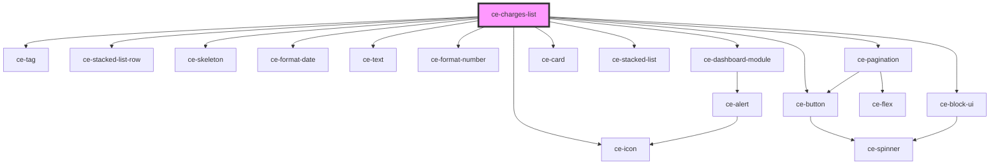

# ce-customer-subscriptions-list

<!-- Auto Generated Below -->

## Properties

| Property         | Attribute         | Description            | Type                                  | Default                                |
| ---------------- | ----------------- | ---------------------- | ------------------------------------- | -------------------------------------- |
| `allLink`        | `all-link`        |                        | `string`                              | `undefined`                            |
| `heading`        | `heading`         |                        | `string`                              | `undefined`                            |
| `query`          | --                | Query to fetch charges | `{ page: number; per_page: number; }` | `{     page: 1,     per_page: 10,   }` |
| `showPagination` | `show-pagination` |                        | `boolean`                             | `true`                                 |

## Dependencies

### Depends on

- [ce-tag](../../../ui/tag)
- [ce-stacked-list-row](../../../ui/ce-stacked-list-row)
- [ce-skeleton](../../../ui/skeleton)
- [ce-format-date](../../../util/format-date)
- [ce-text](../../../ui/text)
- [ce-format-number](../../../util/format-number)
- [ce-dashboard-module](../../../ui/ce-dashboard-module)
- [ce-button](../../../ui/button)
- [ce-icon](../../../ui/icon)
- [ce-card](../../../ui/card)
- [ce-stacked-list](../../../ui/ce-stacked-list)
- [ce-pagination](../../../ui/ce-pagination)
- [ce-block-ui](../../../ui/block-ui)

### Graph

----------------------------------------------

*Built with [StencilJS](https://stenciljs.com/)*
