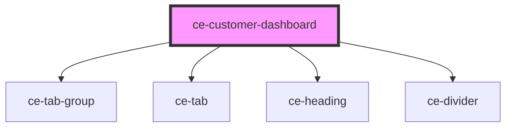

# ce-customer-dashboard

<!-- Auto Generated Below -->

## Properties

| Property     | Attribute     | Description                   | Type     | Default     |
| ------------ | ------------- | ----------------------------- | -------- | ----------- |
| `customerId` | `customer-id` | Pass the current customer id. | `string` | `undefined` |

## Dependencies

### Depends on

- [ce-tab-group](../../../ui/tab-group)
- [ce-tab](../../../ui/tab)
- [ce-heading](../../../ui/heading)
- [ce-divider](../../../ui/divider)

### Graph

----------------------------------------------

*Built with [StencilJS](https://stenciljs.com/)*
